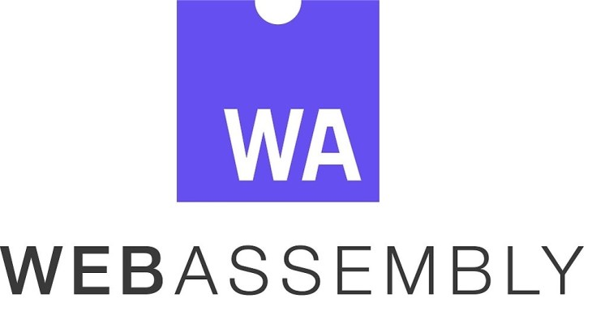
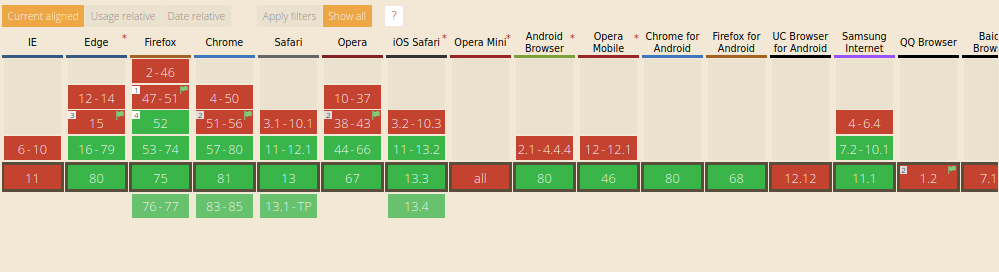
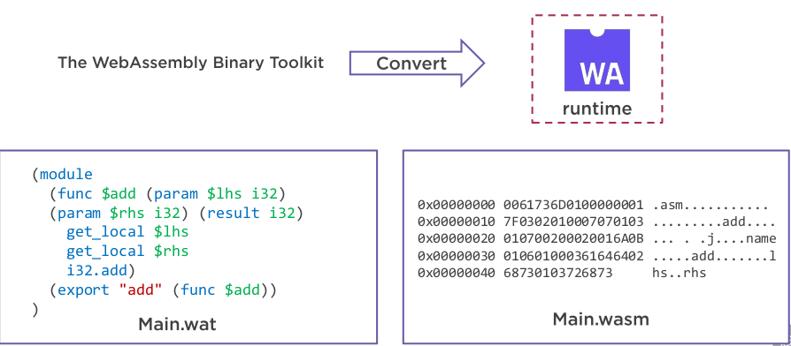
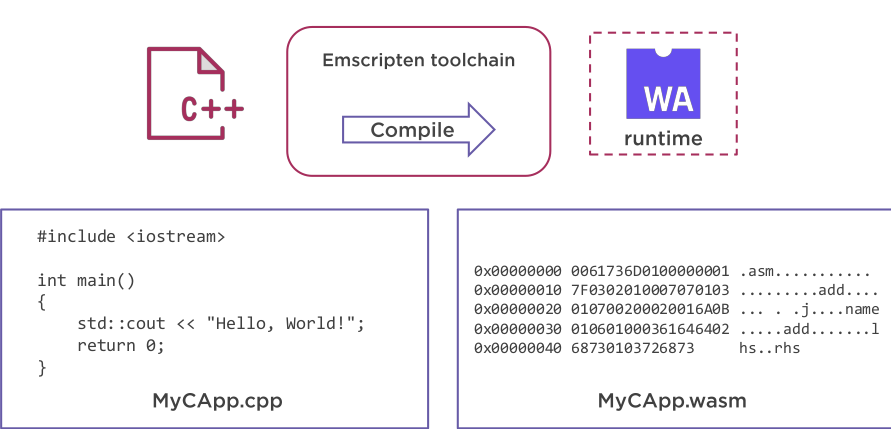
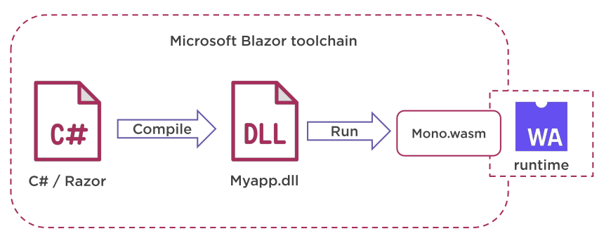
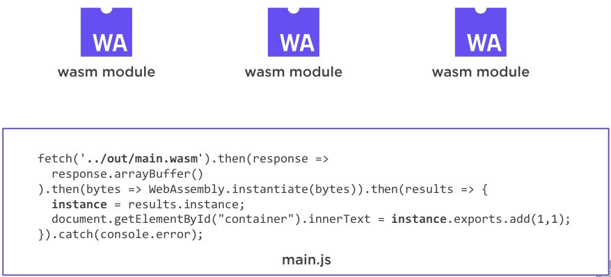
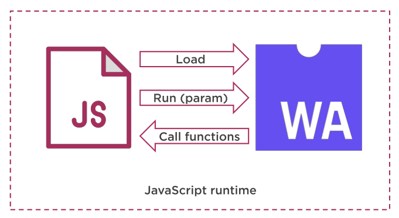

## Que es WebAssembly
- Es el nuevo codigo que se puede ejecutar en navegadores web modernos y proporciona nueva funciones y mejoras importantes en el rendimiento. 
[https://developer.mozilla.org/en-US/docs/WebAssembly](https://developer.mozilla.org/en-US/docs/WebAssembly)
- WebAsembly es una formato de instrucciones binarias para una maquina virtual basada en pilas.
- Wasm esta diseñado para que sea portable para la compilacion de lenguajes de alto nivel como C/C++, Rust que permite la implementacion en la web  para aplicaciones de cliente y servidor.

## Historia
- Comienza en abril 2015: WebAssembly Community Group
- Junio 2015: El grupo anuncia publicamente que estaban trabajando en un nuevo estandar llamado WebAssembly.
- Marzo 2016: El grupo anuncio su primera definicion de las caracteristicas principales que estaran en WASM
- Los navegadores principales empezaron a experimentar con el estandar.
- Octuber 2016 se lanzo el minimo producto viable para que la comunidad lo probara.
- MVP fue implementado por los principales navegadores.
- Enero 2017 la WCG eligio un logo.

- Marzo 2017: Los principales navegadores Chrome, Edge, Firefox y Webkit llegaron a un consenso del Minimo Producto Viable para que no se realize mas funcionalidades sin tener experiencia en la implementacion.
- Agosto 2017 W3C WebAssembly Working Group grupo creado para poder desarrollar el estandar oficial de WASM. Su tarea fue crear los nuevos estandares de wasm para que puedan ser implementados por los proveedoes de navegadores web.
- Febrero 2018: Grupo presento las primeras especificaciones preliminares

## Quien esta desarrollando WASM
- 2015: WebAssembly Community Group
    - Representantes de los princiaples proveedores de navegadores y comunidad (900+ miembros) 
    - Fueron quienes impulsaron su evolución a implementar las versiones tempranas en los principales navegadores tambien fueron quienes implementaron los primeros estandares
- 2017: W3C WebAssembly Working Group
    - Contiene personas de Google, Apple, Facebook, Tencent, W3C, Mozilla, LG Electronics y mas.
    - Su tarea es crear estandares para WebAssembly que puedan ser utilizados por los principales navegadores.

## Porque WebAssembly
- Ejecutar codigo a una velicidad casi nativa.
    - Nota: Algunos test indican que es 20 veces mas rapido que javascript.
- Otros lenguajes como C/C++, C# se pueden compilar en WebAssembly
- Soporte nativo con los navegadores web y no se necesita de ningun plugin para su funcionamiento.
- Las aplicaciones wasm se ejecutan en un etorno seguro como javascript.
- El codigo de javascript puede ejecutar los modulos de wasm.
- 
## Casos de uso de WebAssembly
- Para reautilizar cosas echas en C:
    - tesseract ocr
    - OpenCV
- - Cuando no quiero hacer algo en javascript.
    - C
    - C++
    - Rust
- Editar Video y Audio.
- Streaming de Video y Audio
- Juegos
- Conferencias de Video y Audi
- Realidad Aumentada y Realidad Virtual
- Inteligencia Artificial 
- [https://dev.to/yashints/tensorflow-js-available-on-webassembly-backend-53e4](https://dev.to/yashints/tensorflow-js-available-on-webassembly-backend-53e4)

## Seguridad de WebAssembly
- WebAssembly se ejecuta en un entorno encapsulado
- Se ejecuta con estrictas normas de ejecución
- Se protege al usuario de codigo malisioso

## Herramientas
- [https://webassembly.studio/](https://webassembly.studio/)
- [https://wasdk.github.io/wasmcodeexplorer/](https://wasdk.github.io/wasmcodeexplorer/)

## Soporte navegadores
- [https://caniuse.com/#feat=wasm](https://caniuse.com/#feat=wasm)

## Como usar WebAssembly
- Escribir WebAssemlby tu mismo
- Compilar codigo en WebAssembly como C/C++, Rust, C# 
- Utilizar los modulos de WebAssembly ya existentes en javascript

### Escribir WebAssembly tu mismo

### Compilar codigo en WebAssembly

### Utilizar los modulos de WebAssembly ya existentes en javascript 

### JavaScript trabaja con WebAssembly

## Ejemplos
- Adobe PhotoShop
- Unity
- Autodesk Autocad
- Google con Google Earth
- web-dsp
- Figma
- [Funkykarts](https://www.funkykarts.rocks/demo.html)

## Recursos
- [https://webassembly.org/](https://webassembly.org/)
- [https://developer.mozilla.org/en-US/docs/WebAssembly](https://developer.mozilla.org/en-US/docs/WebAssembly)
- [https://codelabs.developers.google.com/codelabs/web-assembly-intro/index.html#0](https://codelabs.developers.google.com/codelabs/web-assembly-intro/index.html#0)
- [https://dev.to/yashints/tensorflow-js-available-on-webassembly-backend-53e4](https://dev.to/yashints/tensorflow-js-available-on-webassembly-backend-53e4)
- [https://caniuse.com/#feat=wasm](https://caniuse.com/#feat=wasm)
- [https://www.figma.com/blog/webassembly-cut-figmas-load-time-by-3x/](https://www.figma.com/blog/webassembly-cut-figmas-load-time-by-3x/)
- [https://github.com/appcypher/awesome-wasm-langs](https://github.com/appcypher/awesome-wasm-langs)
- [https://www.youtube.com/watch?v=VS4uhnKd67Y](https://www.youtube.com/watch?v=VS4uhnKd67Y)